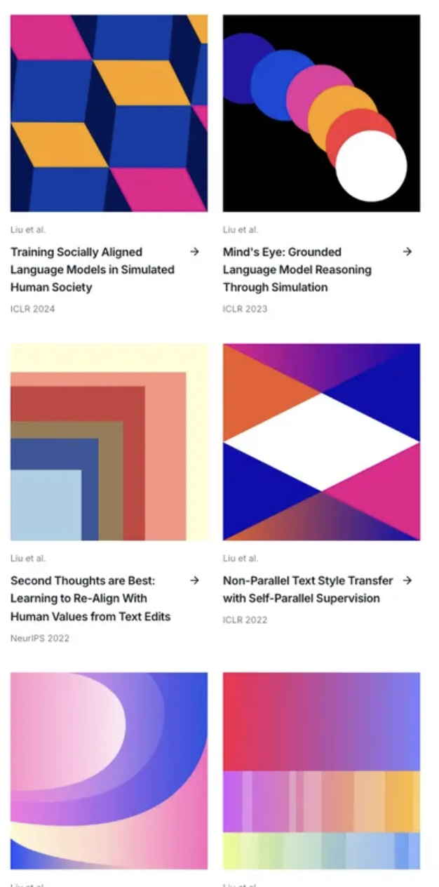

# 🎨 Generative Geometric Art

A powerful web-based tool for creating beautiful algorithmic art with customizable geometric patterns and colors. Built with React, Canvas API, and modern web technologies.



## ✨ Features

### 🎯 Multiple Art Styles
- **X Overlay** - 6-triangle diamond composition with gradient blending
- **Rhombus Weave** - Seamless tessellated diamond patterns  
- **Iso Cubes** - 3D isometric cube arrangements with shadows
- **Tumbling Blocks** - Classic quilting pattern with 3D illusion
- **Corner Steps** - Layered rectangular compositions
- **Orb Trail** - Curved particle trails with physics
- **Concentric** - Nested geometric shapes
- **Diamonds** - Grid-based diamond patterns
- **Orbs** - Overlapping circles with transparency
- **Bands** - Horizontal color bands
- **Waves** - Flowing wave patterns
- **Kites** - Angular geometric compositions

### 🎨 Customization Options
- **15+ Curated Color Palettes** - From vibrant neon to subtle pastels
- **Multiple Aspect Ratios** - Square (1:1), Landscape (16:9), Portrait (3:4)
- **Gradient Controls** - Toggle gradient effects on/off
- **Background Options** - Light and dark background modes
- **Vignette Effects** - Optional depth enhancement
- **Deterministic Seeds** - Reproducible random generation

### 🚀 Advanced Features
- **Real-time Preview** - Instant visual feedback
- **High-Quality Export** - PNG export at 2x resolution for crisp prints
- **Responsive Design** - Works on desktop, tablet, and mobile
- **Hot Reload Development** - Fast development workflow
- **Style-Specific Controls** - Advanced parameters for complex patterns

## 🛠️ Technology Stack

- **React 19** - Modern UI framework
- **Vite** - Fast build tool and dev server
- **HTML5 Canvas** - High-performance 2D graphics
- **Tailwind CSS v4** - Utility-first styling
- **JavaScript ES6+** - Modern language features

## 📦 Getting Started

### Prerequisites
- Node.js 18+ 
- npm or yarn

### Installation

1. Clone the repository
```bash
git clone https://github.com/Allhuo/geometric-art.git
cd geometric-art
```

2. Install dependencies
```bash
npm install
```

3. Start the development server
```bash
npm run dev
```

4. Open your browser and navigate to `http://localhost:5173`

### Building for Production

```bash
npm run build
```

The built files will be in the `dist` directory.

## 🎮 Usage

1. **Choose a Style** - Select from 10+ geometric patterns
2. **Pick Colors** - Browse through curated color palettes
3. **Adjust Settings** - Configure aspect ratio, gradients, and effects
4. **Generate** - Click "Generate New" for different variations
5. **Export** - Save your creation as high-quality PNG

### Advanced Controls

Some styles offer additional parameters:

- **Orb Trail**: Control particle count, radius, trajectory, and curvature
- **Corner Steps**: Adjust layer count, step size, and irregularity
- **Iso Cubes**: Toggle between seamless weave and spaced layouts

## 🧮 Mathematical Foundations

This project implements several algorithmic art techniques:

- **Seeded PRNG** - Deterministic randomness using xmur3 and sfc32
- **Tessellation** - Seamless geometric tiling patterns
- **Color Theory** - Mathematically harmonious palette generation
- **Gradient Interpolation** - Smooth color transitions
- **Geometric Transforms** - Isometric projections and rotations
- **Physics Simulation** - Particle trails with realistic motion

## 🎨 Art Styles Deep Dive

### X Overlay
A sophisticated 6-triangle composition creating diamond-shaped negative space:
- 4 main isosceles triangles from left/right edges
- 2 gradient triangles at top/bottom with color blending
- Natural diamond void in center

### Tumbling Blocks  
Classic quilting pattern creating 3D cube illusion:
- 60° rhombus tessellation
- Three-tone shading (light/medium/dark)
- Reversible cube visual effect

### Orb Trail
Dynamic particle system with curved trajectories:
- Configurable particle count and size
- Physics-based motion along circular arcs
- Gamma-corrected spacing for natural flow

## 🤝 Contributing

Contributions are welcome! Please feel free to submit a Pull Request.

1. Fork the project
2. Create your feature branch (`git checkout -b feature/AmazingFeature`)
3. Commit your changes (`git commit -m 'Add some AmazingFeature'`)
4. Push to the branch (`git push origin feature/AmazingFeature`)
5. Open a Pull Request

## 📄 License

This project is open source and available under the [MIT License](LICENSE).

## 🙏 Acknowledgments

- Inspired by classic geometric art and modern generative design
- Color palettes inspired by contemporary AI/ML paper designs
- Mathematical foundations based on traditional tessellation patterns

---

**🤖 Generated with [Claude Code](https://claude.ai/code)**
